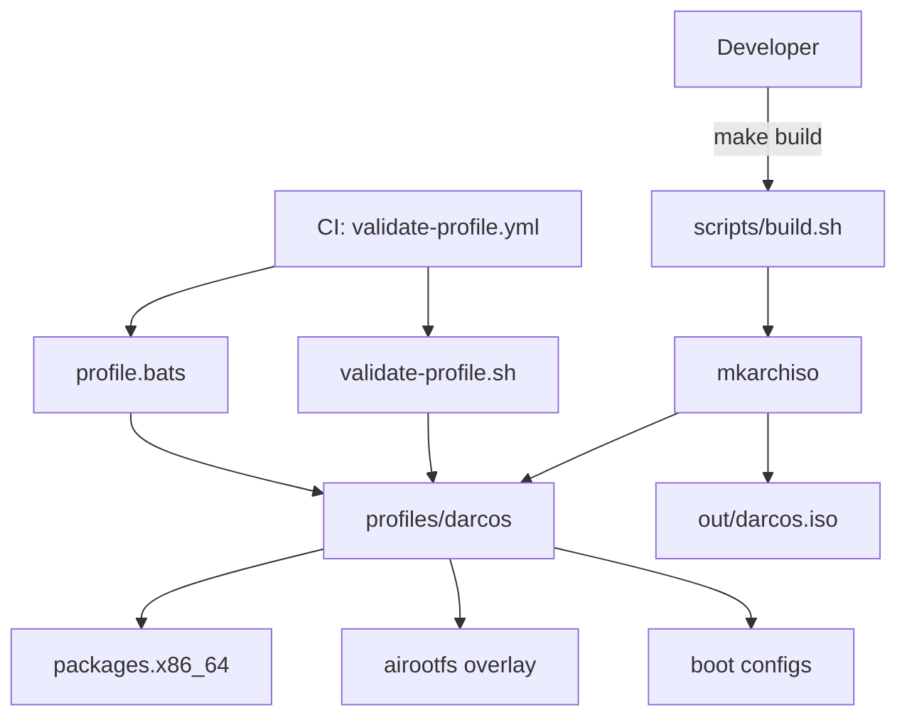

# Cursor Engineering Log — 2026-06-16

## Session: Foundation — DarcOS Custom Arch Linux Distribution Bootstrap

### 🧠 Thought Process & Regression Analysis
- User requested a custom Arch Linux distribution from an empty git repository.
- Chose **archiso** as the build foundation — standard, maintainable, and aligned with Arch tooling.
- **Regression Opportunities**: `profiles/darcos/profiledef.sh`, `packages.x86_64`, `darcos-install`, `validate-profile.sh`, CI workflow.
- **Execution Strategy**: Tests executed via dedicated CI/CD Workflow (`Validate DarcOS Profile`).

### 📐 UML Diagram


### ✅ Deliverables
- archiso profile at `profiles/darcos/`
- Build tooling: `Makefile`, `scripts/build.sh`
- Profile validation tests + GitHub Actions workflow
- DarcOS branding: issue banner, motd, `darcos-install` wrapper

### Workflow
**Workflow Name**: `Validate DarcOS Profile` (`.github/workflows/validate-profile.yml`)

---

## Session: Hermes Agent as Default DarcOS AI

### 🧠 Thought Process & Regression Analysis
- User requested Hermes AI Agent as the default, pre-installed on the DarcOS Arch ISO.
- Integrated [NousResearch/hermes-agent](https://github.com/NousResearch/hermes-agent) via official install script during archiso `automated_script.sh` (root FHS layout → `/usr/local/bin/hermes`).
- **Regression Opportunities**: `install-hermes.sh`, `darcos-ai`, `profile.d/darcos-hermes.sh`, `packages.x86_64`, validation tests.
- **Execution Strategy**: Tests executed via dedicated CI/CD Workflow.

### 📐 UML Diagram
```mermaid
flowchart TD
    A[mkarchiso build] --> B[automated_script.sh]
    B --> C[install-hermes.sh]
    C --> D[curl official Hermes installer]
    D --> E[/usr/local/lib/hermes-agent]
    D --> F[/usr/local/bin/hermes]
    C --> G[/etc/darcos/hermes-seed]
    H[User login] --> I[profile.d/darcos-hermes.sh]
    I --> J[~/.hermes seeded]
    H --> K[darcos-ai → hermes --tui]
```

### ✅ Deliverables
- System-wide Hermes install hook in ISO build
- `darcos-ai` default launcher
- User seed config + first-login hints
- `make build` / `--skip-hermes` for faster dev ISOs
